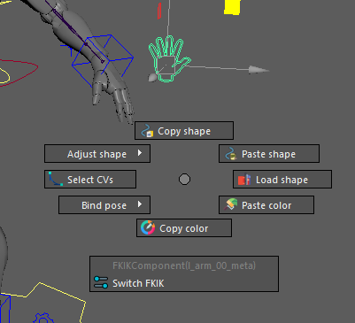

# Luna

## Installation
1. Clone/download repo to anywhere on your machine
2. Create **Luna.mod** in *documents/maya/modules*
3. Add the following lines to it:

```python
+ Luna 0.1.5 YourPathHere/Luna
scripts: YourPathHere/Luna
```

## WIP features and usage examples:
---

- [Control creation](/docs/examples/control.md)
- [Biped python build](/docs/examples/biped.md)


### Menu
---


### Selection based marking menu
---


---
### Builder


### Config dialog
---


