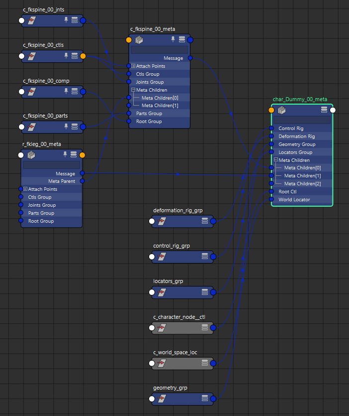
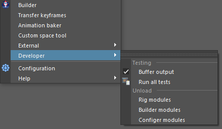
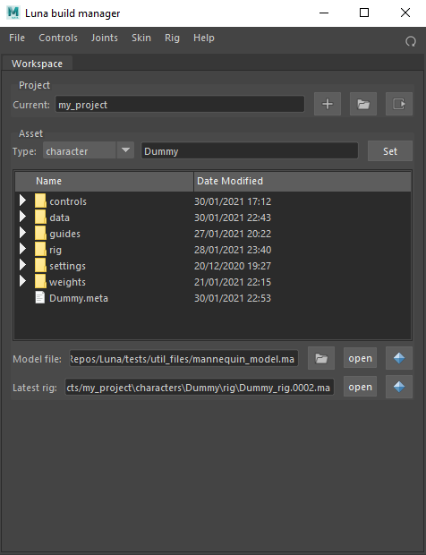
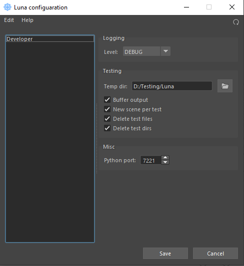

# Luna


## WIP features
- Control to Python object instancing:
  ```python
  import pymel.core as pm
  from Luna import Logger
  from Luna_rig.core.control import Control

  pm.newFile(f=1)
  # Fully create new control
  ctl1 = Control.create(name="arm_ik",
                        side="r",
                        object_to_match=None,
                        joint=True,
                        shape="cube",
                        tag="ik")

  # Instance existing control
  instance_from_name = Control("r_arm_ik_00_ctl")
  # Call class methods on any of instances
  instance_from_name.insert_offset()
  ctl1.write_bind_pose()
  #Set color and shape as properties
  ctl1.color = 3
  ctl1.shape = "circle"
  
  Logger.info(instance_from_name.shape)
  Logger.info(instance_from_name.bind_pose)

  ```
  Both objects represent identical control:
  ```
  [Luna][DEBUG] ========Control instance========
                tree:
                -group: r_arm_ik_00_grp
                -offset_list: [nt.Transform(u'r_arm_ik_00_ofs')]
                -offset: r_arm_ik_00_ofs
                -transform: r_arm_ik_00_ctl
                -joint: r_arm_ik_00_cjnt
                -tag_node: r_arm_ik_00_ctl_tag

                data:
                -side: r
                -name: arm_ik
  ```
- Component to Python object instancing
  ```python
  import pymel.core as pm
  from Luna import Logger
  from Luna_rig import components
  from Luna_rig.core.meta import MetaRigNode
  from Luna_rig.core import control


  pm.newFile(f=1)
  character = components.Character.create(name="mycharacter")
  fk_comp1 = components.FKComponent.create(side="c", name="spine")
  fk_comp2 = components.FKComponent.create(side="r", name="arm", meta_parent=fk_comp1, attach_point=0)

  # Instance from network node
  fk_comp1_instance = MetaRigNode("c_spine_00_meta")

  # Find all components of type. Returns list of Python instances.
  Logger.info(MetaRigNode.list_nodes(of_type=components.FKComponent))
  Logger.info(MetaRigNode.list_nodes(of_type="FKComponent"))

  # Get component from control and controls from component
  char_root_ctl = control.Control("c_character_node__ctl")
  Logger.info(character.root_ctl)
  Logger.info(char_root_ctl.connected_component)

  ```
- Python rig build
  ```python
  import pymel.core as pm
  from Luna import Logger
  from Luna_rig.core import build
  from Luna_rig import components


  class RigBuild(build.PyBuild):
      def run(self):
          self.fkspine = components.FKComponent.create(side="c",
                                                      name="fkspine",
                                                      version=1)
          self.fkleg = components.FKComponent.create(side="r",
                                                    name="fkleg",
                                                    version=1,
                                                    meta_parent=self.fkspine,
                                                    attach_point=0)

      def post(self):
          Logger.info("POST BUILD")


  if __name__ == "__main__":
      result = RigBuild("character", "Dummy", version=1)
  ```
  Result graph:

  


## WIP interface:
### Menu


### Builder


### Config dialog


